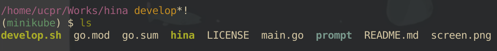

# hina



hina is a shell theme for bash and zsh.

** work in progress **

## Feature
- git branch
- git status
- kubernetes context

If you have the features you want, create an issue please.

## Usage

### Install
```
$ go get -u github.com/ucpr/hina
```

### for Zsh
please add `.zshrc` or `.zsh_profile`.  
rewrite `HINA_PATH` to suit your environment.
```zsh
export HINA_PATH="YOUR_HINA_PATH"

autoload -Uz add-zsh-hook
_hina_prompt() {
  PROMPT=$($HINA_PATH)
}

add-zsh-hook precmd _hina_prompt
```

### for Bash

work in progress.

## Enviroment Variables

mark to represent git status

| name                 | mark (default) |
|----------------------|----------------|
| `HINA_GIT_MODIFIED`  | `*`            |
| `HINA_GIT_ADDED`     | `+`            |
| `HINA_GIT_DELETED`   | `-`            |
| `HINA_GIT_COPIED`    | `$`            |
| `HINA_GIT_RENAMED`   | `~`            |
| `HINA_GIT_UNMERGED`  | `=`            |
| `HINA_GIT_UNTRACKED` | `!`            |

if you want to display k8s context, run `export HINA_K8S=on`

| name       | default   |
|------------|-----------|
| `HINA_K8S` | `off`     |

## Contributions
Welcome!!

## Author
taichi uchihara (@u\_chi\_ha\_ra\_)

## LICENCE
MIT LICENCE
